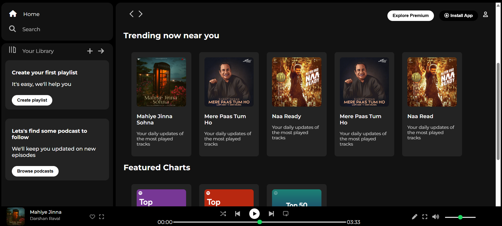

# Spotify-Clone (Frontend Only)
This is a frontend clone of Spotify built using HTML and CSS. It replicates the layout and styling of the Spotify web application.
## Description
- Styled using CSS (Flexbox & Grid)
- Interactive hover effects
## Technologies Used
- ✅ HTML
- ✅ CSS (Flexbox, Grid)
## Screenshot

